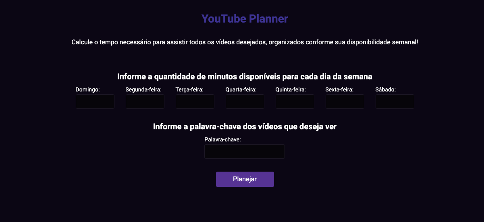

# YouTube Planner

## Contexto

Este projeto trata-se de um site que calcula o tempo necessário para assistir a todos os vídeos desejados do YouTube, organizando-os conforme a disponibilidade semanal indicada, desenvolvido para desktop e mobile (100% responsivo).

Foi desenvolvido com o intuito de aprofundar conceitos de JavaScript Avançado apresentados no primeiro módulo da pós tech Front-end Engineering

<h4>Prévia</h4>

&nbsp;

## Tecnologias usadas

<h4>Front-end</h4>

SASS, JavaScript, Typescript e MSW

&nbsp;

## Instalando as dependências

<h4>Front-end</h4>

pnpm install

&nbsp;

## Variáveis de ambiente

Para executar a aplicação, é preciso criar um arquivo .env seguindo o .env.example

Crie uma chave de acesso através do <a href="https://console.cloud.google.com/welcome" target="_blank">Google Cloud Console</a>

&nbsp;

## Executando a aplicação

<h4>Front-end - Requisições da API</h4>

pnpm dev

<h4>Front-end - Requisições do mock</h4>

pnpm dev:mock

&nbsp;

## Link Vercel

<a href="https://you-tube-planner-eight.vercel.app/" target="_blank">YouTube Planner</a>
